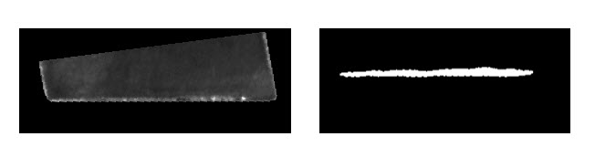
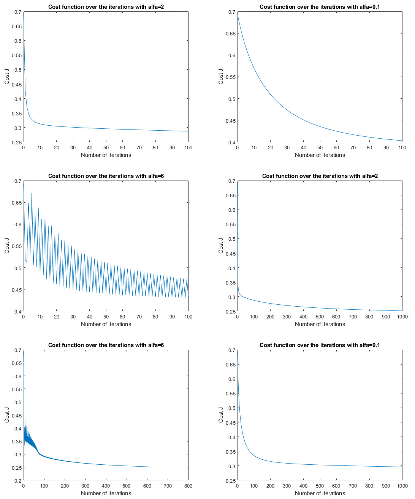
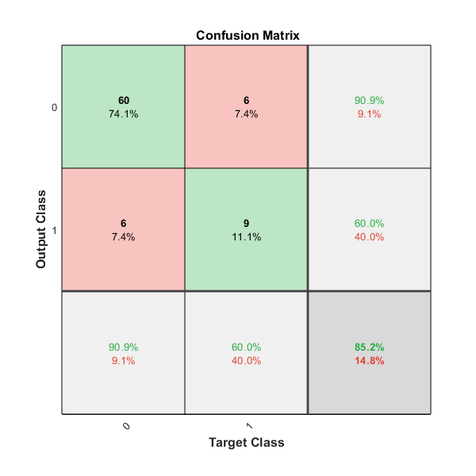
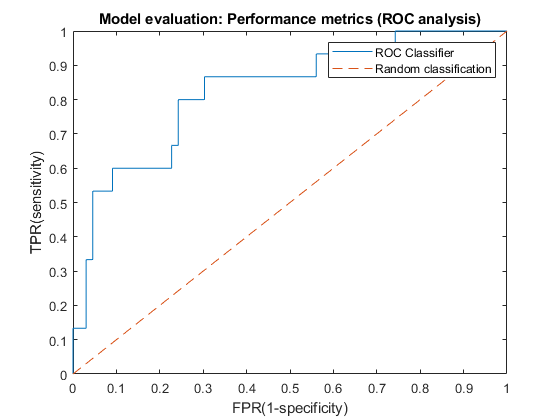
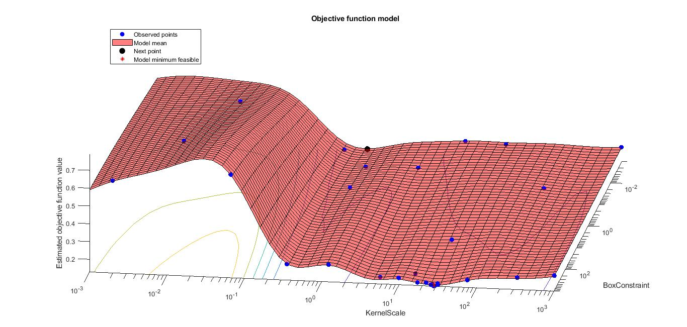
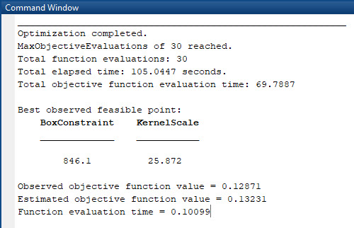
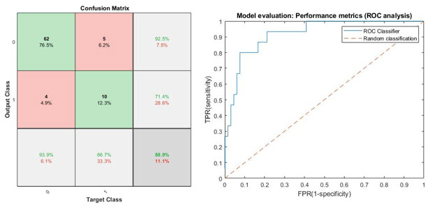
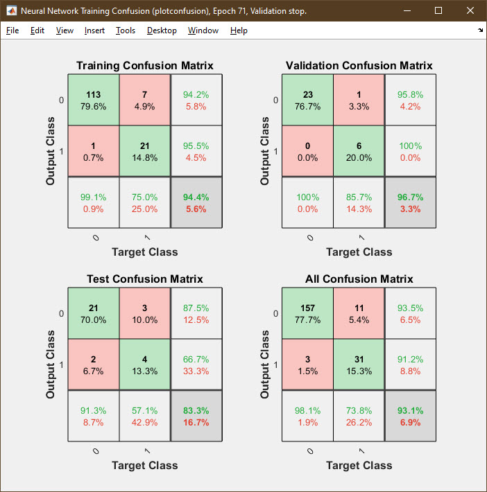
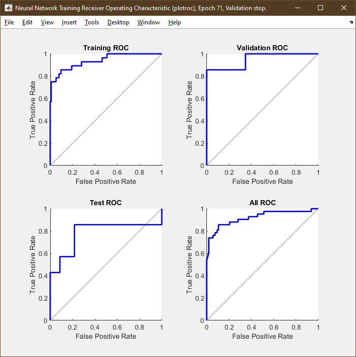
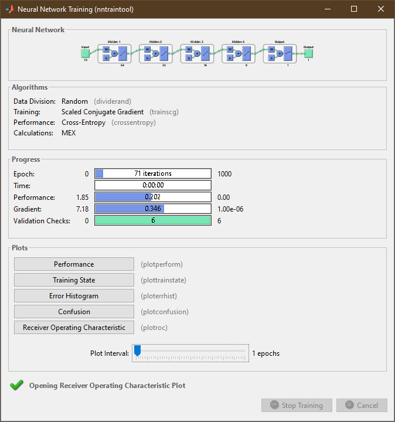

# Tool-wear-classification
In this project we are going to work on the classification method of Logistic Regression. We are going to : 1. Describe a set of images by means of a set region descriptors. 2. Using the computed descriptors, we are going to simulate a classification experiment and calculate some performance metrics from the results of the Logistic Regression classifier.

Language used : MATLAB

The main file is : main_TP_LogisticReg.m

The files used to code the Logistic Regression classifier from scratch (fTrainLogisticReg, funsigmoid, fCalculateCostLogReg, fClassify_LogisticReg.m, fGetShapeFeat.m) were coded by Pr. Víctor González Castro from the Universidad de Leon (Spain), and then completed by me.


# TB3 : Image and Pattern recognition 2019-

# Project (tool wear classification)

## Abdelhakim Benechehab

## December 2019

In this project we are going to work on the classification method of Logistic
Regression. We are going to :

1. Describe a set of images by means of a set region descriptors.
2. Using the computed descriptors, we are going to simulate a classification
experiment and calculate some performance metrics from the results of the
Logistic Regression classifier.
In this experiment, we are going to divide the data set into two disjoint sets :
training and test.

## 1 PART 1 : Description of the images

Here is a sample of the images we are willing to process (both unrefined and
binary format) :


  
The images are binary regions corresponding to cutting edges of insert tools
used in milling processes, from which we will extract 9 features detailed in [3].
The functionfGetShapeFeatcompute the said features for a given region, here
is the script corresponding to what it does :


```
1 stats = regionprops(region,'Area','Eccentricity','Perimeter',
2 'EquivDiameter','Extent','FilledArea','MajorAxisLength',
3 'MinorAxisLength','Solidity');
4
5 Area = getfield(stats,'Area');
6 Eccentricity = getfield(stats,'Eccentricity');
7 Perimeter = getfield(stats,'Perimeter');
8 EquivDiameter = getfield(stats,'EquivDiameter');
9 Extent = getfield(stats,'Extent');
10 FilledArea = getfield(stats,'FilledArea');
11 MajorAxisLength = getfield(stats,'MajorAxisLength');
12 MinorAxisLength = getfield(stats,'MinorAxisLength');
13 Solidity = getfield(stats,'Solidity');
```
## 2 Division of the data between Train and Test sets

Afterwards, the data is randomly split in two disjoint sets : one will be used
for training the classifier and the other one will be used for making the test and,
therefore, assess how good the classifier is.

```
1 % SPLIT DATA INTO TRAINING AND TEST SETS
2
3 num_patterns_train = round(p_train*num_patterns);
4
5 indx_permutation = randperm(num_patterns);
6
7 indxs_train = indx_permutation(1:num_patterns_train);
8 indxs_test = indx_permutation(num_patterns_train+1:end);
9
10 X_train = X(indxs_train, :);
11 Y_train = Y(indxs_train);
12
13 X_test= X(indxs_test, :);
14 Y_test = Y(indxs_test);
```
## 3 PART 2 : Classification

### 3.1 Training of the classifier and classification of the test set

3.1.1 Training

The goal of the training of the Logistic Regression classifier is to estimate
the parameters <bold> Θ = [θ 0 ,θ 1 ,...,θn] </bold> used to estimate the probability that a certain
pattern belongs to the positive class Xi= [xi 0 ,xi 1 ,...,xin]


During the training phase, the parametersΘwill be modified so that they
minimise a cost function, which will yield the average error between the outputs
of the function h and for the training elements and their real classes. In Logistic
Regression, this cost function is given by the following equation :

#### J(Θ) =−1/m∑[yi.ln(hθ(xi)) + (1−yi).ln(1−hθ(xi))]

This optimization is carried out by means of thegradient descentalgo-
rithm, which is an iterative procedure in which each of the components of the
vectorΘare updated on each iteration :

#### θkj=θkj−^1 −α1/m∑(hθ(xi)−yi).xij

where the element xij is the j-th feature of the feature vector that represents the
i-th object (i.e. the i-th pattern), and hθ(x) is the hypothesis function, which is
in this case the sigmoid function :

#### hθ(x) =g(θTx) = 1/(1+e−θTx)

The implementation of the described classifier is in the files :fTrainLogisticReg, funsigmoid, fCalculateCostLogReg.

3.1.2 Classification

Once the classifier is trained (i.e., the vector Θ for which the cost reaches a
minimum has been obtained), the classification of elements that have not been
used in the classification is carried out using Θ.
The following file fClassifyLogisticReg returns the probability for each element
on the test set to belong to the positive class.
In order to quantify the convergence of our classifier, we are able to track
the evolution of the cost function, in the following figures (2), the cost function
is computed depending on two variables, the learning rateαand the number of
iterations.
Regarding the learning rate α, we can see that when its value is excessively
small (0.1) the convergence is so slow taking a big number of iterations to achieve
its stable value. However, if it is so big (6) the algorithm does not converge
anymore and the gradient does not fall in the bottom of the valley and keep
jumping between its walls which explains the sinusoidal behavior.
For the number of iterations, beyond 100 iterations the convergence speed
is not significant, hence we can stop there for a better CPU running time. For
alpha = 2, the cost function at 100 iterations is equal to 0.29, and 0.25 at 1000
iterations which are relatively close.
Now after getting the probability of belonging to the positive class, we assign
to every observation a class using a decision threshold normally equal to 0.5 :



```
1 % CLASSIFICATION OF THE TEST SET
2 Y_test_hat = fClassify_LogisticReg(X_test, theta);
3
4 %%
5 % Assignation of the class
6 Y_test_asig = Y_test_hat≥0.5;
```

### 3.2 Assessment of the performance of the classifier

3.2.1 Confusion Matrix

Once the estimated classes of all the elements of the test set, we can calculate
performance metrics, based on the confusion matrix. The most basic one is the
accuracy, Which is the percentage of the elements that have been well classified.
Other metrics are also necessary in case of our Data are imbalanced, a detailed
explanation of all those metrics is given here [1].
A key tool to computing all these metrics is the Confusion matrix, it gives
the values of all four categories : True positive, False negative, False positive
and True negative. Here is a code that compute this matrix and its values for
the first classifier :

```
1 Cfman = zeros(2,2);
2
3 for i = 1:
4 if (Y_test(i) == 1) && (Y_test_asig(i) == 1)
5 Cfman(1,1) = Cfman(1,1)+1;
6 elseif (Y_test(i) == 0) && (Y_test_asig(i) == 1)
7 Cfman(2,1) = Cfman(2,1)+1;
8 elseif (Y_test(i) == 1) && (Y_test_asig(i) == 0)
9 Cfman(1,2) = Cfman(1,2)+1;
10 elseif (Y_test(i) == 0) && (Y_test_asig(i) == 0)
11 Cfman(2,2) = Cfman(2,2)+1;
12 end
13 end
14
15 Cf = Cfman;
16
17 %For better graphics, the figure is made using the plotconfusion ...
Matlab function
18 figure;
19 plotconfusion(Y_test, Y_test_asig);
```
The confusion matrix (figure 3) has strong values in its diagonal hence we
can already tell that our classifier is not bad. We can now compute the accuracy
and the F-score for this classifier :

```
1 accuracy = trace(Cf)/sum(sum(Cf));
2
3 Precision = Cf(1,1)/(Cf(1,1)+Cf(2,1));
4
5 Recall = Cf(1,1)/(Cf(1,1)+Cf(1,2));
6
7 FScore = 2*((Precision*Recall)/(Precision+Recall));
8
9 fprintf('\n******\nAccuracy = %1.4f%% (classification)\n', ...
accuracy*100);
10 fprintf('\n******\nFScore = %1.4f (classification)\n', FScore);
```


  

```
Accuracy= 85. 1852
```
```
FScore= 0. 6000
```
Looking at the accuracy value (0.85), We can assume that our classifier is
very efficient. But like we saw in the course material the accuracy rate can be a
very falsy criterion if our data is strongly asymmetric.
To get rid of any doubt we will check the value of the F-Score that takes in
consideration the asymmetry of the problem, this indicator (0.6) confirms our
pre-thoughts about our classifier, since the value is relatively high and that our
data are quite unbalanced.

3.2.2 ROC analysis

The ROC curve is a curve that shows the evolution of the sensitivity (True
Positive) to 1-specificity (False positive) depending on the decision threshold t
that we have previously chosed as 0.5. A detailed explanation of this performance
metric is explained in [2].
Here is a function that calculates the ROC curve for a given validation set :

```
1 function [TPR,FPR] = ROC(Y0,Ytest)
2 T = 0:0.001:1;
3 [n, m] = size(T);
4
5 TPR = zeros(1,m);
6 FPR = zeros(1,m);
7
8 for j=1:m
9 Y1 = Ytest≥(T(j));
10
11 Cfman = zeros(2,2);
12
13 for i=1:
14 if (Y0(i) == 1) && (Y1(i) == 1)
15 Cfman(1,1) = Cfman(1,1)+1;
16 elseif (Y0(i) == 0) && (Y1(i) == 1)
17 Cfman(2,1) = Cfman(2,1)+1;
18 elseif (Y0(i) == 1) && (Y1(i) == 0)
19 Cfman(1,2) = Cfman(1,2)+1;
20 elseif (Y0(i) == 0) && (Y1(i) == 0)
21 Cfman(2,2) = Cfman(2,2)+1;
22 end
23 end
24
25 Cf = Cfman;
26
27 tpr = Cf(1,1)/(Cf(1,1)+Cf(1,2));
28 fpr = Cf(2,1)/(Cf(2,1)+Cf(2,2));
29
30 TPR(j) = tpr;
31 FPR(j) = fpr;
32 end
33 end
```
Let’s try it on our test Data :



The curve we got is more than sufficient to tell that our classifier is robust,
it is entirely above the first bisector. To make sure we will calculate the value
of its integral on the [0,1] domain -the area under the curve-

```
1 [n, m] = size(TPR);
2 q = 0;
3 %Integral is computed using the rectangle rule
4 for i=1:(m-1)
5 q=q+(FPR(i)-FPR(i+1))*TPR(i);
6 end
```
```
q= 0. 8242
```
## 4 Support Vector Machines (SVM) Classifier

According to wikipedia an SVM model is a representation of the examples
as points in space, mapped so that the examples of the separate categories are
divided by a clear gap that is as wide as possible. New examples are then mapped
into that same space and predicted to belong to a category based on the side of
the gap on which they fall.
Details about the method are given in [7] chapter "More About".
For an SVM model, the parameters that make the most difference in the classification performance are the soft margin parameter C (BoxConstraint) of
the classifier and the kernel type. The kernel type is either ’linear’ (usual scalar
product), ’Gaussian’ or ’Polynomial’ (see [7] for formulas)
In order to optimize these parameters, a built-in function in MATLAB exists
and would give us the best BoxConstraint and the best kernelScale for a given
kernel type, here is the implementation of such optimization and its results :
figure 5

```
1 %HyperParameters optimization and kernelType selection
2 Modl = fitcsvm(X,Y,'KernelFunction','polynomial',
3 'OptimizeHyperparameters','auto','HyperparameterOptimizationOptions',
4 struct('AcquisitionFunctionName','expected-improvement-plus'));
5
6 %tried on three kernels : linear, gaussian and polynomial
```
This process was tried on the three kernel types cited above, and the best
result (smallest value of the Estimated objective function value which is a mea-
sure of the difference between prediction and reality using a cross validation
method) is obtained with kernel type polynomial.
The hyper-parameters optimization gives the following results as well : figure
6





At this stage, we have the parameters and the kernel type of our model
chosed, all we have to do is to train this model using built-in MATLAB functions
for SVM binary classification as following :

```
1 Modlfinal = fitcsvm(X_train,Y_train,'KernelFunction','polynomial',
2 'kernelScale',25.872,'BoxConstraint',846.1);
3
4 [label,score] = ...
predict(fitPosterior(compact(Modlfinal),X_train,Y_train),X_test);
5
6 Y_test_asig = label';
7
8 table(Y_test',Y_test_asig',score(:,2),'VariableNames',...
9 {'TrueLabel','PredictedLabel','PostProb'})
10
11 figure;
12 plotconfusion(Y_test, Y_test_asig);
```

Here is the corresponding Confusion Matrix and ROC curve : figure 7



The performance metrics give the following as well :

```
Accuracy= 88. 8889
```
```
FScore= 0. 6897
```
Conclusion : The SVM methods are quite better than the logistic regression
classifier for our data, though they require more CPU running time in order to
chose the best parameters to fit our model.

## 5 Neural Networks Classifier

The classical shallow neural networks are very strong tools to fit any function
and might be very robust in binary classification problems, an introduction to
the mathematics behind can be found in [4].
In MATLAB, a GUI for neural networks exists to facilitate their use, however
I chose to write its script down directly in command line.Details given in [6] and
[5].
The number of hidden layers and neurons in every layer was decided after
several tries in order to achieve a maximum of accuracy for the validation set,
the result is the following script :

```
1 inputs = X';
2 targets = Y;
3
4 % Create a Pattern Recognition Network
5 hiddenLayerSize = [64 32 16 8]; % 4 hidden layers
6 net = patternnet(hiddenLayerSize);
7
8 % Set up Division of Data for Training, Validation, Testing
9 net.divideParam.trainRatio = 70/100;
10 net.divideParam.valRatio = 15/100;
11 net.divideParam.testRatio = 15/100;
12
13 % Train the Network
14 [net,tr] = train(net,inputs,targets);
15
16 % Test the Network
17 outputs = net(inputs);
18 errors = gsubtract(targets,outputs);
19 performance = perform(net,targets,outputs);
20
21 % View the Network
22 view(net)
```
The function view(net) gives you a summary of your neural network and its
performance using this window : figure 8



We can see a diagram of our neural network at the top of the window, it
also displays the number of iterations needed to train the network (epochs) and
how many validation checks our network has passed (6/6 in this case).
It offers us the performance metrics we used to compute manually for other
classifiers, let’s visualize the confusion matrix and the ROC curve for example :
figure 9 and 10



Our network achieved 96.7% of accuracy for the validation set and 93.1%
globally, which is very satisfying comparing to the previous classifiers we have
tried.
This is confirmed by the ROC analysis that shows an under-curve surface
very close to 1.
If trained multiple times, the network might not give the same results, this
is due to the fact that the data separation is arbitrary and the training pro-
cess depends strongly on the input data. In some cases the input data are not
sufficient for a good accuracy, in other cases we may face over-fitting.




An improvement of this network would be a CNN (convolutional neural
networks) with multiple dropout, Max-Pooling and regularization layers that
will avoid the problems mentioned in the previous paragraph.

## 6 Conclusion

Due to the simplicity of the images we are classifying, the three of the classi-
fiers we tried (Logistic regression, SVM, neural network) worked relatively well
and gave satisfying results.
We applied multiple performance metrics to validate our classifiers and com-
pare them.
The best accuracy we could achieve is 93.1% using a neural network with
four hidden layers.


## Références

[1] RahulAgarwal.The 5 Classification Evaluation metrics every Data Scien-
tist must know.url: https://towardsdatascience.com/the-5-classification-evaluation-metrics-you-must-know-aa97784ff226.

[2] KaranBhanot.Machine Learning Classifier evaluation using ROC and
CAP Curves.url: https://towardsdatascience.com/machine-learning-classifier-evaluation-using-roc-and-cap-curves-7db60fe6b716.

[3] Víctor González-Castro Rocío Alaiz-RodríguezMaría Teresa García-
OrdásEnrique Alegre-Gutiérrez. “Combining shape and contour features
to improve tool wear monitoring in milling processes”. In :International
Journal of Production Research Volume 56 (2017), p. 3901-3913.doi:
https://www.tandfonline.com/doi/full/10.1080/00207543.2018.1435919.

[4] ChrisNicholson.A Beginner’s Guide to Neural Networks and Deep Lear-
ning.url: https://pathmind.com/wiki/neural-network.

[5] Unknown.Classify Patterns with a Shallow Neural Network.url:
https://fr.mathworks.com/help/deeplearning/gs/classify-patterns-with-a-neural-network.html.

[6] Unknown.Fit Data with a Shallow Neural Network.url: https://fr.mathworks.com/help/deeplearning/gs/fit-data-with-a-neural-network.html.

[7] Unknown.fitcsvm.url: https://fr.mathworks.com/help/stats/fitcsvm.html.


